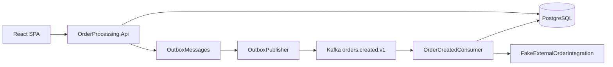

# Order Processing

Code challenge Full Stack .NET 8 + React: recebimento autenticado de pedidos, persistência atômica com **Transactional Outbox**, publicação em **Apache Kafka**, consumo idempotente com **Inbox + EventId** e atualização condicional de `Pending → Processing`.

O endpoint HTTP **nunca** espera a integração externa. A integração simulada (5–10 segundos) **nunca** executa com transação ou conexão de banco aberta.

## Architecture

A solução segue Hexagonal Architecture / Ports and Adapters de forma pragmática.

- `OrderProcessing.Domain` contém entidades e comportamento. Não referencia Dapper, PostgreSQL, Kafka, Keycloak ou HTTP.
- `OrderProcessing.Application` contém use cases e ports (`IOrderRepository`, `IOutboxRepository`, `IInboxRepository`, `IExternalOrderIntegration`, `IUnitOfWork`).
- `OrderProcessing.Infrastructure` implementa os adapters: Dapper/Npgsql, DbUp, Kafka, OutboxPublisher, Consumer e `FakeExternalOrderIntegration`.
- `OrderProcessing.Api` apenas autentica, recebe HTTP, chama Application e devolve DTOs / ProblemDetails.



## Project structure

```
src/
  OrderProcessing.Domain
  OrderProcessing.Application
  OrderProcessing.Infrastructure
  OrderProcessing.Api
tests/
  OrderProcessing.Tests
frontend/
  order-processing-web
infra/keycloak/realm-order-processing.json
docker-compose.yml
```

Não existe projeto Worker separado. `OutboxPublisher` e `OrderCreatedConsumer` são `BackgroundService` registrados pela API (`AddHostedService`) e sobem no mesmo processo quando a API inicia.

O enunciado aceita Worker **ou** BackgroundService. Deixamos na API de propósito: este é um challenge de 6 horas, um único `dotnet run` basta para avaliar o fluxo. Em produção esses hosted services sairiam para um worker dedicado (processo/container separado), para a API escalar com o HTTP e o consumer escalar com o Kafka, sem um restart da API derrubar o processamento.

### Dependências

- Domain → nenhum projeto
- Application → Domain
- Infrastructure → Application, Domain
- Api → Application, Infrastructure

## How to run

### 1. Infraestrutura

```bash
docker compose up -d
```

Sobe:

- PostgreSQL em `localhost:5432` (banco vazio; schema **não** vem de `docker-entrypoint-initdb.d`)
- Kafka em KRaft (sem ZooKeeper) em `localhost:9092`
- Topic `orders.created.v1` com 3 partitions (container `kafka-init`)
- Kafka UI em `http://localhost:8081`
- Keycloak em `http://localhost:8080`

Logins locais (são telas diferentes):

| Onde | URL | Usuário | Senha |
|---|---|---|---|
| Aplicação React / token da API | `http://localhost:5173` (realm `order-processing`) | `demo` | `demo123` |
| Aplicação React (alternativa) | `http://localhost:5173` | `admin` | `admin` |
| Console admin do Keycloak | `http://localhost:8080` (realm `master`) | `admin` | `admin` |

`demo` **não** existe no console admin. Se a tela mostrar "Administration Console", use `admin` / `admin`, não `demo`.

### 2. API

```bash
dotnet run --project src/OrderProcessing.Api
```

Na inicialização o DbUp aplica somente as migrations ainda não executadas. Se a migration falhar, a API **não** sobe silenciosamente.

- API: `http://localhost:5080`
- Swagger (Development): `http://localhost:5080/swagger`
- Health: `http://localhost:5080/health`

### 3. Frontend

```bash
cd frontend/order-processing-web
npm install
npm run dev
```

A landing page redireciona para o Keycloak (Authorization Code + PKCE). Depois:

1. `GET /api/products` carrega o catálogo
2. `POST /api/orders` devolve `202 Accepted` com `Pending`
3. A grid de pedidos faz polling a cada 2,5s e mostra `Pending → Processing → Completed|Failed`

### 4. Testes

```bash
dotnet test
```

## Docker Compose

A aplicação espera a infraestrutura ficar healthy. O publisher e o consumer retentam sozinhos se o Kafka ainda estiver subindo. O DbUp faz retry curto até o PostgreSQL aceitar conexão; se as migrations falharem de fato, o host aborta.

## PostgreSQL + DbUp

Persistência com **Dapper + Npgsql**. Sem Entity Framework.

Scripts incrementais em `Infrastructure/Persistence/Migrations`, embutidos como `EmbeddedResource`:

1. `001_CreateProducts.sql`
2. `002_CreateOrders.sql`
3. `003_CreateOrderItems.sql`
4. `004_CreateOrderProcessingAttempts.sql`
5. `005_CreateOutboxMessages.sql`
6. `006_CreateInboxMessages.sql`
7. `007_CreateIndexes.sql`
8. `008_SeedProducts.sql`

Reiniciar a API não reexecuta scripts já aplicados.

## Keycloak

- Realm importado automaticamente: `order-processing`
- SPA pública `order-processing-web` com PKCE
- Audience `order-processing-api` no access token
- Backend: `JwtBearer`
- `UserId` do pedido vem da claim `sub`
- Sem roles/RBAC
- JWT nunca é logado

## Kafka

- Biblioteca: `Confluent.Kafka`
- Topic: `orders.created.v1`
- Message key: `OrderId` (eventos do mesmo pedido na mesma partition)
- Producer: `EnableIdempotence = true`, `Acks = All`, retries
- Consumer group: `order-processing-v1`
- `EnableAutoCommit = false`
- Offset só é commitado depois da persistência local do processamento
- Headers: `event-id`, `event-type`, `event-version`, `correlation-id`

O producer idempotente do Kafka **não** substitui o Inbox Pattern. Ele evita duplicatas internas do protocolo Kafka; não resolve redelivery de negócio nem crash entre publish e `PublishedAtUtc`.

## Transactional Outbox

`POST /api/orders` faz **uma** transação local:

1. valida request e usuário JWT (`sub`)
2. busca produtos e preços no PostgreSQL
3. cria `Order` + `OrderItems` (snapshot de `ProductName` e `UnitPrice`)
4. cria `OutboxMessage` `OrderCreatedV1` (`Id` = `EventId`)
5. `COMMIT`
6. HTTP `202 Accepted` `{ orderId, status: "Pending" }`

Se qualquer insert falhar, rollback de tudo. Pedido sem outbox não existe.

O `OutboxPublisher`:

- reclama batches com `FOR UPDATE SKIP LOCKED`
- incrementa `PublishAttempts`
- publica no Kafka e espera confirmação
- só então grava `PublishedAtUtc`
- em falha grava `LastError`
- **não** mantém transação aberta enquanto espera o Kafka

Publicação Kafka e `PublishedAtUtc` **não** são uma transação distribuída.

### Crash do publisher

1. Kafka aceita a mensagem
2. a aplicação morre antes de persistir `PublishedAtUtc`
3. o publisher reclama a mesma linha de novo
4. o mesmo `EventId` é publicado outra vez

O consumer precisa ignorar a duplicata. Por isso Inbox é obrigatório.

## Inbox / Idempotent Consumer

Dois mecanismos complementares, com responsabilidades diferentes:

| Mecanismo | Pergunta que responde |
|---|---|
| Inbox + `EventId` UNIQUE | Esta **mensagem** já foi finalizada? |
| `UPDATE Orders SET Status = 'Processing' WHERE Status = 'Pending'` | Este **agregado** ainda pode entrar em processamento? |

Kafka entrega *at-least-once* em vários cenários: rebalance, crash do consumer, retry do outbox. Duplicatas são esperadas.

Fluxo do consumer:

1. deserializa `OrderCreatedV1` e valida versão
2. se `InboxMessages.EventId` já está `Processed`, não chama a integração e confirma o offset
3. **TX #1**: insert inbox, `Pending → Processing` condicional, cria `OrderProcessingAttempt`
4. `COMMIT` e fecha a conexão
5. `IExternalOrderIntegration.ProcessAsync(orderId, eventId)` — delay 5–10s
6. **TX #2**: finaliza tentativa, `Processing → Completed|Failed`, marca inbox processada
7. `COMMIT`
8. commit do offset Kafka

Não existe retry automático de negócio. Uma falha da integração marca o pedido como `Failed`. Retry de negócio fica como evolução.

## Transactional boundaries

Proibido:

```
BEGIN
  Pending → Processing
  HTTP / delay 5-10s
  Completed
COMMIT
```

Obrigatório:

```
TX #1: Pending → Processing + Attempt início
fechar conexão
ExternalIntegration.ProcessAsync()
TX #2: Attempt fim + Completed|Failed + Inbox Processed
```

Isso evita lock de banco durante a chamada externa e mantém o HTTP livre.

## Concurrency

A solução assume at-least-once + idempotência, não exactly-once mágico.

Cobre:

- múltiplos OutboxPublishers (`SKIP LOCKED`)
- múltiplos consumers no mesmo group (partitions)
- redelivery por crash
- a mesma mensagem publicada duas vezes

`EventId` impede reexecução da integração **depois que o evento foi finalizado**.  
`Order.Status` impede dois processamentos simultâneos simples do mesmo pedido.

## Integração externa e exactly-once

`FakeExternalOrderIntegration` recebe `idempotencyKey = EventId` mesmo sendo uma simulação.

Se a aplicação morrer **depois** que o sistema externo executou o efeito e **antes** da TX #2, não existe garantia real de exactly-once sem o sistema externo honrar a idempotency key. O README deixa isso explícito porque esse é o limite real de sistemas distribuídos, não um detalhe da implementação.

Modos em `ExternalIntegration:Mode`:

- `AlwaysSuccess`
- `AlwaysFail`
- `Random`

## Failure scenarios

- Validação (`items` vazio, `quantity <= 0`, produto inexistente, preço inválido) → `400 ValidationProblemDetails`
- Pedido inexistente → `404 ProblemDetails`
- Falha no insert do outbox → rollback do pedido
- Kafka indisponível → outbox permanece unpublished e será retentado
- Integração falha → `Order = Failed`, `OrderProcessingAttempt.Success = false`
- Crash após publish Kafka e antes de `PublishedAtUtc` → republicação + Inbox ignora duplicata
- Crash após TX #1 e antes da integração → redelivery retoma o processamento com a mesma `EventId` como chave

## Correlation ID

O middleware aceita `X-Correlation-ID` ou gera um. O valor vai para o evento, os headers Kafka e os logs estruturados (`OrderId`, `EventId`, `CorrelationId`).

## Frontend

React + TypeScript + TanStack Query + Keycloak JS.

- formulário com produtos do catálogo
- botão desabilitado durante o POST (anti double submit)
- exibição de ProblemDetails
- grid paginada
- detalhes do pedido
- polling 2–3s
- sem SignalR/WebSocket

## Testes obrigatórios

- criação válida: persistência, preços do banco, `Pending`, `OutboxMessage`
- sem itens
- `quantity <= 0`
- produto com preço inválido
- falha da integração → `Failed` + attempt `Success = false`
- mesmo `EventId` duas vezes → integração uma vez
- falha do outbox → pedido não permanece criado

## Trade-offs

- Kafka foi escolhido mesmo sendo opcional no enunciado, para tornar explícito o caminho assíncrono e a defesa de duplicidade.
- Outbox + Inbox aumentam o número de tabelas, mas separam atomicidade local de entrega assíncrona.
- BackgroundServices na API são um recorte de challenge, não o modelo de produção. Em produção o start seria um worker à parte (`dotnet run` / container próprio), com o mesmo código de Infrastructure.
- Polling no React é deliberadamente simples. SignalR seria mais imediato e também mais superfície para o prazo do desafio.
- Sem MediatR, CQRS complexo, Event Sourcing, Redis ou 2PC.

## Production improvements

Itens conscientes **não** implementados agora:

- Kubernetes / autoscaling
- Redis
- OpenTelemetry completo
- retry/backoff de negócio com política explícita
- saga / process manager
- dead-letter topic e alerta de poison pill
- outbox em CDC (Debezium) no lugar de polling
- worker dedicado fora da API
- exactly-once ponta a ponta somente se o sistema externo aceitar idempotency key
- hardening de Keycloak, secrets e HTTPS

## Decisões não especificadas no enunciado

- PostgreSQL como banco (o enunciado aceitava SQL Server/equivalente)
- DbUp com scripts embutidos
- Consolidação explícita de `ProductId` duplicado somando quantidades
- `AlwaysSuccess` como default local para a primeira execução ser observável
- Testes de aplicação com fakes transacionais, para `dotnet test` não depender de Docker
